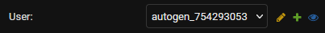

# Configuration

After installing the [BRECcIA Network Mapper](https://github.com/Southampton-RSG/breccia-mapper), some configuration must be done in the web interface. You will need to log in with an admin account.

:::{note}
Admin dashboard: this is the admin section of the site, accessed by clicking `Admin` in the navigation bar at the top of the screen.
:::

## Setup

### Activity Mediums

Each activity medium is a property of an activity - intended for storing, for example, whether the activity was face-to-face or virtual. Add an activity medium for each medium you wish to be available.

- In the admin dashboard, click `Add` next to `Activity mediums` and provide the name of the medium.

### Activity Types

Activities are categorised into types. Add an activity type for each type you wish to be available. For example: meetings, seminars, and training courses.

- In the admin dashboard, click `Add` next to `Activity types` and provide the name of the activity type.

### Activity Series

Activities in a series (e.g. a set of connected meetings or courses) can be linked together with an activity series. Activity series are created in the admin dashboard, and activities are linked to series when creating or updating the activities.

When new activity series next to be created, create them in the admin dashboard.

- In the admin dashboard, click `Add` next to `Activity series` and provide the name of the series, along with the type and medium of the activities in this series.

### Site Theme

If desired, you can adjust the site's theming through the admin dashboard. All of the below steps are optional.

- In the admin dashboard, click `Bootstrap themes` under `BOOTSTRAP_CUSTOMIZER`, then select `Default Theme`.
- Toggle rounded corners (e.g. for buttons), shadows, and gradients with the checkboxes.
- Click each colour to change it - a pop-up will appear allowing you to choose the new colour.
- Change the site's fonts by replacing the content of the `Font family base` field.
- Change the font size with the `Font size base` field.
- Change the line height with the `Line height base` field.
- Change the main background and text colours with the `Body background` and `Body color` fields respectively.

- Change the heading font by expanding the `Headings` section and replacing the content of the `Headings font family` field.
- Change the heading font weight (i.e. thickness) by expanding the `Headings` section and replacing the content of the `Headings font weight` field.
- Change the heading line height by expanding the `Headings` section and replacing the content of the `Headings line height` field.

Then click `Save`.

### Main Configuration Options

There are several general settings which must be configured. Open the admin dashboard and click `Config` under `CONSTANCE`, then configure the available settings, as explained below.

- `CONSENT_TEXT`: The text shown to users when requesting consent to use their data. This text accompanies a checkbox captioned `I have read and understood this information and consent to my data being used in this way`.
- `PERSON_LIST_HELP`: Help text to display at the top of the people list.
- `ORGANISATION_LIST_HELP`: Help text to display at the top of the organisaton list.
- `RELATIONSHIP_FORM_HELP`: Help text to display at the top of relationship forms.
- `HOMEPAGE_HEADER_IMAGE_SHRINK`: Whether the homepage header image should be shrunk to display the whole image at all times.
- `HOMEPAGE_HEADER_IMAGE`: The header image for the homepage.
- `HOMEPAGE_CARD_1_TITLE`: The title for the first card displayed on the homepage.
- `HOMEPAGE_CARD_1_DESCRIPTION`: The description for the first card displayed on the homepage.
- `HOMEPAGE_CARD_1_ICON`: The icon for the first card displayed on the homepage. Icons are FontAwesome 6 icons, which are listed [here](https://fontawesome.com/v6/search?m=free).
- `HOMEPAGE_CARD_2_TITLE`: The title for the second card displayed on the homepage.
- `HOMEPAGE_CARD_2_DESCRIPTION`: The description for the second card displayed on the homepage.
- `HOMEPAGE_CARD_2_ICON`: The icon for the second card displayed on the homepage. Icons are FontAwesome 6 icons, which are listed [here](https://fontawesome.com/v6/search?m=free).
- `HOMEPAGE_CARD_3_TITLE`: The title for the third card displayed on the homepage.
- `HOMEPAGE_CARD_3_DESCRIPTION`: The description for the third card displayed on the homepage.
- `HOMEPAGE_CARD_3_ICON`: The icon for the third card displayed on the homepage. Icons are FontAwesome 6 icons, which are listed [here](https://fontawesome.com/v6/search?m=free).
- `HOMEPAGE_ABOUT_TITLE`: The title for the about section on the homepage.
- `HOMEPAGE_ABOUT_CONTENT`: The content for the about section on the homepage. HTML is accepted.
- `HOMEPAGE_ABOUT_IMAGE`: The image for the about section on the homepage.
- `NOTICE_TEXT`: Text to be displayed in a notice banner at the top of every page.
- `NOTICE_CLASS`: CSS class to use for the background of the notice banner.
- `PARENT_PROJECT_NAME`: The name of the project's parent project, if one exists.
- `PROJECT_LEAD`: The project's lead person, organisation, or similar.
- `PROJECT_TAGLINE`: The project's tagline.
- `ALLOW_SIGNUPS`: Whether new users should be able to sign themselves up through the site. This is useful for minimising the number of users that must be manually created, and it is recommended that this feature is disabled once all users have created their accounts.
- `ENABLE_GOOGLE_LOGIN`: Whether login through Google should be enabled. Only enable this if Google login has been configured. See [Google login](#google).
- `ENABLE_MICROSOFT_LOGIN`: Whether login through Microsoft should be enabled. Only enable this if Microsoft login has been configured. See [Microsoft login](#microsoft).

Then click `Save`.

### Questions

There are several types of questions, but they all have the same set of information stored in them:

- `Version`: The version of the question - this should be incremented when the question is altered.
- `Text`: The main text of the question.
- `Filter text`: Each question appears as a filter on the `Network` page. This is alternative text to replace the full question as the filter title. If left blank, the main text of the question will be used.
- `Help text`: Help text shown below the question when people enter their answer.
- `Answer is public`: Whether answers to this question should be considered public.
- `Is multiple choice`: Whether users should only be allowed to select multiple options, instead of just one.
- `Hardcoded field`: The name of the hardcoded field that the question relates to. This is not applicable for non-preset questions (i.e. ones that you create).
- `Allow free text`: Whether users should be allowed to enter their own text in addition to choosing an available option. When a user enters free text, a new option will be created with their input.
- `Order`: The priority order for the question to be displayed in. Lower priority questions will be displayed earlier in the list of questions.
- Question choices
	- `Text`: The main text of the option.
	- `Order`: The priority order for the option to be displayed in. Lower priority options will be displayed earlier in the list of options.
	- `Is negative response`: Only applicable for relationship questions. Whether the option indicates the relationship is of the lowest level of closeness. This allows automatic population of questions if the relationship being reported is not at all close. All options marked as negative responses will be selected when this button is pressed.
	- `Delete?`: Whether the option should be deleted when the question is saved.

There are various types of questions, which can be added by clicking `Add` next to the appropriate section in the admin dashboard:

- Organisation questions: Questions that are shown when creating an organisation or updating its details.
- Organisation relationship questions: Questions that are shown when reporting a relationship with an organisation.
- Person questions: Questions that are shown when creating a person or updating their details.
- Relationship questions: Questions that are shown when reporting a relationship with a person.

### Existing Questions

Some "person questions" (i.e. questions about people) are preset, but require answers to be provided.

1. In the admin dashboard, click `Person questions` under `PEOPLE`, then select each of the following questions in turn:

	- Disciplines
	- Research theme affiliation
	- Role

2. For each question, provide a set of possible answers as per the instructions [above](#questions).

:::{note}
At least one organisation must also exist for people to be able to create their profiles (unless the organisation question is removed). To create an organisation follow the instructions [below](#organisations).
:::

### Organisations

Organisations are created through the main site (not the admin dashboard).

1. Click `Organisations` in the navigation bar at the top of the screen.
2. Click `New Organisation` at the top of the page.
2. Answer the questions shown.
4. Finally click `Submit`.

### People

:::{note}
When a `Person` is created for a user who does not have an account, an anonymous account is created for them - with login disabled and a random username (starting `autogen_`). This allows administrators to edit their details on their behalf. You should not delete these users unless you wish to delete all data relating to that person.
:::

People are created through the main site (not the admin dashboard). People should only be created when it is known that the person will not have a login of their own to the site - e.g. for researchers logging data for multiple individuals.

1. Click `People` in the navigation bar at the top of the screen.
2. Click `New Person` at the top of the page.
2. Answer the questions shown.
4. Finally click `Submit`.

## Federated Login

Federated login is supported for Google an Microsoft accounts, and can be set up through the `SOCIAL ACCOUNTS` section of the admin dashboard.

### Google

You will first need to create an OAuth application in Google Cloud Platform. You can do this by following [Google's guide](https://support.google.com/cloud/answer/6158849). The redirect URL is `[your-site-url]/accounts/google/login/callback/`.

Then:

- In the admin dashboard, click `Add` next to `Social applications`.
- Select `Google` as the provider.
- Enter `Google` as the name.
- Enter the client ID from Google in the `Client id` field.
- Enter the client secret from Google in the `Secret key` field.
- Leave the `Key` field blank.
- Click `Choose all` under the `Available sites` box, to enable Google login on this site.
- Click `Save`.

Then enable Google login with the `ENABLE_GOOGLE_LOGIN` option in the `Config` section of the admin dashboard, as per [these instructions](#main-configuration-options).

### Microsoft

You will first need to create an OAuth application in Azure Active Directory. You can do this by following [Microsoft's guide](https://learn.microsoft.com/en-us/azure/active-directory/develop/quickstart-register-app). The redirect URL is `[your-site-url]/accounts/microsoft/login/callback/`. You will also need to add a client secret.

Then:

- In the admin dashboard, click `Add` next to `Social applications`.
- Select `Microsoft Graph` as the provider.
- Enter `Microsoft` as the name.
- Enter the `Application (client) ID` from Azure in the `Client id` field. This is obtained from the `Overview` page and is different to the `Secret ID`.
- Enter the client secret value from Google in the `Secret key` field.
- Leave the `Key` field blank.
- Click `Choose all` under the `Available sites` box, to enable Google login on this site.
- Click `Save`.

Then enable Microsoft login with the `ENABLE_MICROSOFT_LOGIN` option in the `Config` section of the admin dashboard, as per [these instructions](#main-configuration-options).

(inviting_users)=
## Inviting Users

In the admin dashboard, click `Add` next to `Users`. Choose a username for them, enter their email address, and enter a temporary password. It does not matter what this password is, and you do not need to remember or store it, as the new user is automatically sent an email welcoming them to the platform and providing instructions for how to reset their password.

If the user you wish to invite has already had a `Person` created for them, they will already have an account with login disabled and a random username (starting `autogen_`). To find this account, go to `People` (in the `PEOPLE` section) in the admin dashboard and select the appropriate person. Then click the blue eye icon next to the `User` field.

This will take you to the user, and you can then change their username and add a first name, last name, and email address. Note that a welcome email will not be sent to the user in this case, so you will have to let them know that their account is active and what their username is. They can use the *forgot password* option when logging in to set their password.
